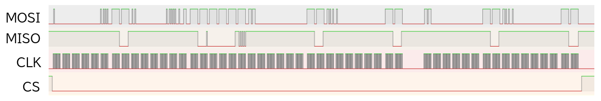

# fpga-spi-sdc
このプロジェクトでは、FPGA(Tang Nano 9k)を用いてSDカードから色情報を読み取ることを目的としています。

## 概要
- FPGAベースのSDカード用SPIコントローラ
- SDカードの初期化およびコマンド処理

## 現在の進捗
学習内容や実装の進捗は、以下のスライドにまとめています：
- [SDカードとのアクセス（FAT32について）](https://speakerdeck.com/brucandy/sdkadotonoakusesu-fat32nituite)

現在はSDカードの初期化まで完了しています。

## 波形（SDカード初期化）
以下の波形は、SDカード初期化時のロジックアナライザの波形を示したものです。

  

